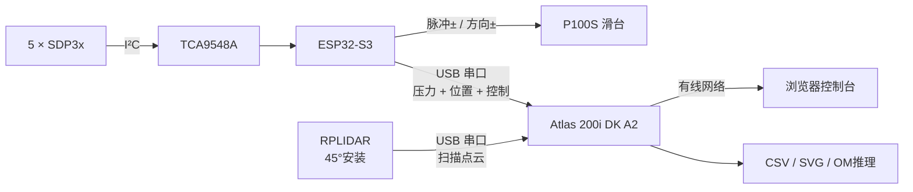

<div align="center">

# 无人机具身气压感知实验平台

基于 **ESP32-S3 + Huawei Atlas 200i DK A2 + RPLIDAR + P100S 滑台** 的数据采集、障碍物识别与推理系统


</div>

## 项目概览

系统让滑台带动传感器按设定速度往复运动，同时采集气压与激光雷达数据。ESP32-S3负责传感器读取和P100S脉冲控制，Atlas负责网页、批量实验、数据对齐、图像生成和神经网络推理。



### 当前能力

| 模块 | 功能 |
|---|---|
| ESP32-S3 | 5路SDP3x采样、单向卡尔曼滤波、模拟数据、滑台运动与看门狗 |
| Atlas | 双USB接入、实时网页、自动批次、数据保存、绘图与Ascend OM推理 |
| RPLIDAR | 连续扫描、完整圈校验、45°坐标变换、全行程持续点簇检测 |
| 融合判断 | 雷达候选与压力异常按时间和位置匹配，输出确认/疑似/未知状态 |
| 训练工具 | 按实验批次划分数据、训练单通道压力CNN、导出ONNX |

## 目录结构

```text
Drone/
├─ main/                 ESP32-S3固件
│  ├─ capture_usb.c      原生USB JSON串口
│  ├─ protocol.c         二进制UART兼容链路
│  ├─ sdp3x.c            SDP3x与TCA9548A
│  └─ servo.c            P100S运动控制
├─ atlas/                Atlas一体化服务
│  ├─ service.py         网页、批次、串口和融合调度
│  ├─ lidar_runtime.py   连续雷达与位置同步
│  ├─ model_detector.py  压力模型推理
│  └─ web/               深色控制台
├─ training/             电脑端模型训练与ONNX导出
├─ web/                  ESP32 USB开发诊断页面
└─ tests/                ESP32主机侧测试
```

详细说明：

- [Atlas部署与雷达融合](atlas/README.md)
- [电脑端模型训练](training/README.md)

## 硬件参数

| 参数 | 当前默认值 |
|---|---:|
| 压力传感器 | 5 × SDP3x，经TCA9548A通道0～4 |
| 采样频率 | 200 Hz |
| 传感器滤波 | 一维卡尔曼，Q = 0.03 Pa²，R = 0.02 Pa² |
| 滑台行程 | 0～2000 mm |
| P100S脉冲当量 | 80 pulse/mm |
| 默认测量范围 | 10～1900 mm |
| 默认测量/复位速度 | 1500 / 1000 mm/s |
| 固件速度上限 | 2000 mm/s |
| 雷达安装俯角 | 45° |
| ESP32 / 雷达串口 | 115200 baud |

P100S参数为`FA11=10000`：电机一圈需要10000个指令脉冲，同步带每圈移动125 mm，因此换算为80 pulse/mm。1500 mm/s对应120 kpps，2000 mm/s对应160 kpps。

## 接线

### SDP3x与TCA9548A

| ESP32-S3 | TCA9548A | 说明 |
|---|---|---|
| 3.3V | VCC | 3.3V供电 |
| GND | GND | 公共地 |
| GPIO1 | SDA | 主I²C数据线 |
| GPIO2 | SCL | 主I²C时钟线 |

五个同地址SDP3x必须分别接入TCA9548A通道0～4：`SDA → SDx`、`SCL → SCx`。主总线SDA/SCL上拉至3.3V；不要把5V直接接入ESP32的I²C引脚。

### P100S四线控制

| ESP32-S3 | P100S | 默认电平行为 |
|---|---|---|
| GPIO4 | 脉冲+ | 3.3V正相脉冲，空闲为高 |
| GPIO5 | 脉冲- | 与脉冲+互补，空闲为低 |
| GPIO6 | 方向+ | 前进/反向方向控制 |
| GPIO7 | 方向- | 当前固件运动期间保持低电平 |

方向与现场相反时，在`idf.py menuconfig → Drone controller → Invert motion direction`中切换，不需要交换脉冲线。

### Atlas双USB连接

| Atlas USB设备 | 用途 | 常见设备名 |
|---|---|---|
| ESP32-S3原生USB | 压力、位置、状态和滑台命令 | `/dev/ttyACM0` |
| RPLIDAR USB适配器 | 连续5字节扫描数据 | `/dev/ttyUSB0` |

Atlas会自动识别ESP32原生USB的JSON行协议，同时兼容原来的二进制透明串口。推荐使用`/dev/serial/by-id/`中的固定路径，避免重启后设备编号变化。

```bash
python3 -m serial.tools.list_ports -v
ls -l /dev/serial/by-id/
```

## 快速开始

### 1. 编译ESP32-S3固件

```bash
idf.py set-target esp32s3
idf.py menuconfig
idf.py build
idf.py flash monitor
```

固件默认同时提供原生USB数据流、UART兼容链路和ESP32调试网页。正式联动由Atlas统一控制，不要同时从多个页面下发滑台命令。

### 2. 部署Atlas服务

将`atlas/`复制到算力板，例如：

```text
/home/HwHiAiUser/drone/atlas
```

然后执行：

```bash
cd /home/HwHiAiUser/drone/atlas
python3 -m pip install --user -r requirements.txt
chmod +x run.sh
./run.sh --host 0.0.0.0 --port 8080
```

电脑与Atlas通过网线连接后，访问：

```text
http://Atlas有线IP:8080
```

### 3. 配置设备

在网页“设备连接”区域：

1. ESP串口填写ESP32对应的`/dev/ttyACM*`或`/dev/serial/by-id/*`路径。
2. 雷达串口填写RPLIDAR对应的`/dev/ttyUSB*`或固定路径。
3. 雷达波特率设为`115200`，安装俯角设为`45°`。
4. 将激光雷达设为“开启”，保存设置。
5. 等待页面显示“ESP串口在线”和“雷达在线”。

## 自动实验参数

| 阶段 | 默认设置 |
|---|---:|
| 起点 / 终点 | 10 / 1900 mm |
| 测量速度 | 1500 mm/s |
| 测量缓启动 / 缓停止 | 225 / 75 mm |
| 复位速度 | 1000 mm/s |
| 复位缓启动 / 缓停止 | 150 / 150 mm |
| 基线等待 | 2000 ms |
| 终点停留 | 300 ms |
| 实验间隔 | 1000 ms |

缓启停参数按距离设置。短行程不足以容纳两个缓冲区时，固件自动降低峰值速度形成三角速度曲线。

## 雷达与压力融合

雷达线程不会只观察滑台末端，而是在完整行程范围内执行：

```text
雷达字节流 → 5字节节点校验 → 完整扫描圈 → ESP位置插值
           → 45°世界坐标 → 走廊点簇 → 连续多圈确认

压力数据 → 滤波 → 滑动窗口规则/OM模型 ─┐
                                        ├→ 时间 + 位置融合
雷达持续点簇 ──────────────────────────┘
```

| 状态 | 含义 |
|---|---|
| 确认障碍物 | 雷达点簇与压力异常在时间和位置上吻合 |
| 雷达疑似 | 雷达检测到持续点簇，尚未得到压力确认 |
| 压力疑似 | 压力出现异常，尚未得到雷达确认 |
| 无障碍 | 当前没有满足连续性要求的候选 |
| 融合不可用 | 雷达未连接或尚未形成有效扫描圈 |

默认融合容差为1500 ms和450 mm。几何走廊、聚类尺寸、连续圈数和融合容差都可以在Atlas的`config.json`中调整。

## 数据输出

每个批次保存在：

```text
atlas/data/<实验条件>/
```

| 文件 | 内容 |
|---|---|
| `<时间>_<批次>.csv` | 200 Hz压力、ESP位置、实验参数、雷达候选和融合状态 |
| `<时间>_<批次>_lidar.csv` | 雷达逐点时间戳、插值位置、角度、距离、质量和XYZ坐标 |
| `<时间>_<批次>.svg` | 当前批次滤波叠加图 |
| `condition_comparison.svg` | 同一实验条件下的批次对比图 |

压力CSV当前为schema 6。压力和雷达文件共享`trial_id`与`host_monotonic_s`，训练时可以直接按实验和时间对齐，不需要通过文件行号推测。

## 模型训练与部署

训练在电脑虚拟环境中进行，Atlas只负责推理。完整命令见[training/README.md](training/README.md)。典型流程为：

```text
带标签CSV → 按批次划分训练/验证/测试 → 单通道CNN
          → pressure_ramp.onnx → ATC → pressure_ramp.om
          → Atlas models/ → 网页启用OM模型
```

同一次批次的数据不会拆到训练集和测试集两边，避免相近重复实验造成虚高准确率。

## 测试

```bash
cd atlas
PYTHONPATH=. python3 -m unittest discover -s tests -v
```

当前Atlas协议、运动、采集、绘图、雷达解析、位置同步与融合共41项测试通过。

## 使用边界

- ESP32上报的位置来自已输出脉冲推算，不是编码器绝对位置。
- 雷达点簇阈值与融合容差需要使用现场同步数据标定，不能仅凭默认值评价最终准确率。
- 当前融合结果用于实验记录与推理，不会因未经标定的雷达候选自动停止滑台。
- `web/`下的独立页面用于开发诊断；正式实验使用Atlas网页。
