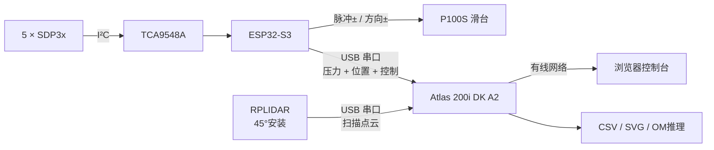

<div align="center">

# 无人机具身气压感知实验平台

基于 **ESP32-S3 + Huawei Atlas 200i DK A2 + RPLIDAR + P100S 滑台** 的数据采集、障碍物识别与推理系统


</div>

## 项目概览

系统让滑台带动传感器按设定速度往复运动，同时采集气压与激光雷达数据。ESP32-S3负责传感器读取和P100S脉冲控制，Atlas负责网页、批量实验、数据对齐、图像生成和神经网络推理。



### 当前能力

| 模块 | 功能 |
|---|---|
| ESP32-S3 | 5路SDP3x采样、单向卡尔曼滤波、模拟数据、滑台运动与看门狗 |
| Atlas | 双USB接入、实时网页、自动批次、数据保存、绘图与Ascend OM推理 |
| RPLIDAR | 连续扫描、完整圈校验、45°坐标变换、全行程持续点簇检测 |
| 融合判断 | 雷达候选与压力异常按时间和位置匹配，输出确认/疑似/未知状态 |
| 训练工具 | 按实验批次划分数据、训练单通道压力CNN、导出ONNX |

## 目录结构

```text
Drone/
├─ main/                          ESP32-S3固件源码
│  ├─ main.c                      固件入口、任务初始化与状态协调
│  ├─ capture_usb.c               原生USB JSON行协议
│  ├─ protocol.c                  二进制UART兼容协议
│  ├─ sdp3x.c                     SDP3x采样与TCA9548A通道切换
│  ├─ sensor_filter.c             压力滤波
│  ├─ servo.c                     P100S脉冲、方向与软限位控制
│  └─ web_wifi/                   ESP32侧诊断网页资源
├─ atlas/                         Atlas一体化服务
│  ├─ service.py                  HTTP服务、批次、串口与融合调度
│  ├─ lidar_runtime.py            连续雷达解析、点云与位置同步
│  ├─ lidar_workflow.py           雷达采样状态机与独立判定流程
│  ├─ model_detector.py           压力规则/ONNX/OM推理入口
│  ├─ models/                     随部署交付的模型与说明
│  ├─ tests/                      Atlas单元与集成测试
│  └─ web/                        Atlas控制台前端
├─ training/                      电脑端训练、评估与ONNX导出
│  └─ output_*/                   模型、清单、预测结果与训练报告
├─ analysis/                      离线实验分析和最终对比图
├─ docs/                          硬件连接与项目技术文档
├─ tests/                         固件算法和网页主机侧测试
├─ web/                           独立USB开发诊断页面
├─ sdkconfig.defaults             可复现的ESP-IDF默认配置
└─ CMakeLists.txt                 ESP-IDF工程入口
```

详细说明：

- [Atlas部署与雷达融合](atlas/README.md)
- [电脑端模型训练](training/README.md)
- [当前供电硬件连接与软件技术报告](docs/当前供电硬件连接与软件技术报告.md)

## 环境要求

| 环境 | 建议版本 | 用途 |
|---|---|---|
| ESP-IDF | 6.0.2 | 编译、烧录ESP32-S3固件 |
| Python | 3.8或更高 | Atlas服务、分析脚本；训练建议使用独立虚拟环境 |
| Node.js | 18或更高 | 运行网页逻辑测试，不参与板端运行 |
| CANN / ATC | 与Atlas 200i DK A2镜像匹配 | 将ONNX转换为OM并执行NPU推理 |
| Git | 2.30或更高 | 获取源码和版本管理 |

Atlas运行环境只要求`pyserial`；`numpy`和`ais_bench`由CANN环境提供，并且仅在启用OM推理时使用。电脑训练依赖`numpy`、`torch`和`onnx`，详见`training/requirements.txt`。不要把电脑端完整训练环境复制到Atlas板端。

## 硬件参数

| 参数 | 当前默认值 |
|---|---:|
| 压力传感器 | 5 × SDP3x，经TCA9548A通道0～4 |
| 采样频率 | 200 Hz |
| 传感器滤波 | 一维卡尔曼，Q = 0.03 Pa²，R = 0.02 Pa² |
| 滑台行程 | 0～2000 mm |
| P100S脉冲当量 | 80 pulse/mm |
| 默认测量范围 | 10～1900 mm |
| 默认测量/复位速度 | 1500 / 1000 mm/s |
| 固件速度上限 | 2000 mm/s |
| 雷达安装俯角 | 45° |
| ESP32 / 雷达串口 | 115200 baud |

P100S参数为`FA11=10000`：电机一圈需要10000个指令脉冲，同步带每圈移动125 mm，因此换算为80 pulse/mm。1500 mm/s对应120 kpps，2000 mm/s对应160 kpps。

## 接线

### SDP3x与TCA9548A

| ESP32-S3 | TCA9548A | 说明 |
|---|---|---|
| 3.3V | VCC | 3.3V供电 |
| GND | GND | 公共地 |
| GPIO1 | SDA | 主I²C数据线 |
| GPIO2 | SCL | 主I²C时钟线 |

五个同地址SDP3x必须分别接入TCA9548A通道0～4：`SDA → SDx`、`SCL → SCx`。主总线SDA/SCL上拉至3.3V；不要把5V直接接入ESP32的I²C引脚。

### P100S四线控制

| ESP32-S3 | P100S | 默认电平行为 |
|---|---|---|
| GPIO4 | 脉冲+ | 3.3V正相脉冲，空闲为高 |
| GPIO5 | 脉冲- | 与脉冲+互补，空闲为低 |
| GPIO6 | 方向+ | 前进/反向方向控制 |
| GPIO7 | 方向- | 当前固件运动期间保持低电平 |

方向与现场相反时，在`idf.py menuconfig → Drone controller → Invert motion direction`中切换，不需要交换脉冲线。

### Atlas双USB连接

| Atlas USB设备 | 用途 | 常见设备名 |
|---|---|---|
| ESP32-S3原生USB | 压力、位置、状态和滑台命令 | `/dev/ttyACM0` |
| RPLIDAR USB适配器 | 连续5字节扫描数据 | `/dev/ttyUSB0` |

Atlas会自动识别ESP32原生USB的JSON行协议，同时兼容原来的二进制透明串口。推荐使用`/dev/serial/by-id/`中的固定路径，避免重启后设备编号变化。

```bash
python3 -m serial.tools.list_ports -v
ls -l /dev/serial/by-id/
```

## 快速开始

### 1. 获取源码

```bash
git clone https://github.com/RylanTu/Embodied-Perception-of-Drones.git
cd Embodied-Perception-of-Drones
```

仓库不保存个人`sdkconfig`、构建目录、串口日志、浏览器渲染配置或临时报告文件。首次构建时，ESP-IDF会根据`sdkconfig.defaults`生成本机`sdkconfig`。

### 2. 编译ESP32-S3固件

```bash
idf.py set-target esp32s3
idf.py menuconfig
idf.py build
idf.py flash monitor
```

固件默认同时提供原生USB数据流、UART兼容链路和ESP32调试网页。正式联动由Atlas统一控制，不要同时从多个页面下发滑台命令。

### 3. 部署Atlas服务

将`atlas/`复制到算力板，例如：

```text
/home/HwHiAiUser/drone/atlas
```

然后执行：

```bash
cd /home/HwHiAiUser/drone/atlas
python3 -m pip install --user -r requirements.txt
chmod +x run.sh
./run.sh --host 0.0.0.0 --port 8080
```

电脑与Atlas通过网线连接后，访问：

```text
http://Atlas有线IP:8080
```

也可以在电脑端生成不含Git历史、缓存和临时文件的部署包：

```bash
mkdir -p dist
git archive --format=zip --output=dist/atlas_deploy.zip HEAD atlas
```

解压后应保留顶层`atlas/`目录。仓库本地的`dist/`专门用于放置这类可重新生成的部署产物，并已加入忽略规则。

### 4. 配置设备

在网页“设备连接”区域：

1. ESP串口填写ESP32对应的`/dev/ttyACM*`或`/dev/serial/by-id/*`路径。
2. 雷达串口填写RPLIDAR对应的`/dev/ttyUSB*`或固定路径。
3. 雷达波特率设为`115200`，安装俯角设为`45°`。
4. 将激光雷达设为“开启”，保存设置。
5. 等待页面显示“ESP串口在线”和“雷达在线”。

### 5. 首次联调

1. 断开电机动力或把速度、行程设到安全的低值，先确认ESP串口与雷达串口没有填反。
2. 打开模拟数据，验证五路压力、位置、批次状态和CSV下载链路。
3. 关闭模拟数据，以5～10 mm短行程确认脉冲方向；方向错误时通过menuconfig切换反向配置。
4. 检查软限位、急停与断线看门狗，再逐步恢复正式行程和速度。
5. 正式采集前固定传感器、风扇、障碍物和雷达安装姿态，并为每组条件使用独立方案名称。

## 自动实验参数

| 阶段 | 默认设置 |
|---|---:|
| 起点 / 终点 | 10 / 1900 mm |
| 测量速度 | 1500 mm/s |
| 测量缓启动 / 缓停止 | 225 / 75 mm |
| 复位速度 | 1000 mm/s |
| 复位缓启动 / 缓停止 | 150 / 150 mm |
| 基线等待 | 2000 ms |
| 终点停留 | 300 ms |
| 实验间隔 | 1000 ms |

缓启停参数按距离设置。短行程不足以容纳两个缓冲区时，固件自动降低峰值速度形成三角速度曲线。

## 雷达与压力融合

雷达线程不会只观察滑台末端，而是在完整行程范围内执行：

```text
雷达字节流 → 5字节节点校验 → 完整扫描圈 → ESP位置插值
           → 45°世界坐标 → 走廊点簇 → 连续多圈确认

压力数据 → 滤波 → 滑动窗口规则/OM模型 ─┐
                                        ├→ 时间 + 位置融合
雷达持续点簇 ──────────────────────────┘
```

| 状态 | 含义 |
|---|---|
| 确认障碍物 | 雷达点簇与压力异常在时间和位置上吻合 |
| 雷达疑似 | 雷达检测到持续点簇，尚未得到压力确认 |
| 压力疑似 | 压力出现异常，尚未得到雷达确认 |
| 无障碍 | 当前没有满足连续性要求的候选 |
| 融合不可用 | 雷达未连接或尚未形成有效扫描圈 |

默认融合容差为1500 ms和450 mm。几何走廊、聚类尺寸、连续圈数和融合容差都可以在Atlas的`config.json`中调整。

## 数据输出

每个批次保存在：

```text
atlas/data/<实验条件>/
```

| 文件 | 内容 |
|---|---|
| `<时间>_<批次>.csv` | 200 Hz压力、ESP位置、实验参数、雷达候选和融合状态 |
| `<时间>_<批次>_lidar.csv` | 雷达逐点时间戳、插值位置、角度、距离、质量和XYZ坐标 |
| `<时间>_<批次>.svg` | 当前批次滤波叠加图 |
| `condition_comparison.svg` | 同一实验条件下的批次对比图 |

压力CSV当前为schema 6。压力和雷达文件共享`trial_id`与`host_monotonic_s`，训练时可以直接按实验和时间对齐，不需要通过文件行号推测。

### 数据与产物管理

- `atlas/data/`是板端运行数据目录。原始CSV通常体积较大，建议按日期和实验条件定期备份，不要直接提交包含大量重复采样的整批目录。
- `analysis/output/`只保留需要复现论文、报告或验收结论的最终PNG、SVG和JSON；浏览器用户目录`edge-render-*`属于渲染缓存，不应纳入版本管理。
- `training/output_*/`保存与已发布模型对应的权重、ONNX、数据划分清单和评估结果。删除训练输出前先确认Atlas部署模型仍可追溯。
- `dist/`保存本机部署压缩包，可由当前提交重新生成，因此不提交到Git。
- `tmp/`、`build/`、`__pycache__/`、`.pytest_cache/`、`sdkconfig`和日志均为本机产物，由`.gitignore`统一排除。

对于需要长期留存的数据，至少同时保存原始CSV、实验方案、固件提交号、Atlas提交号和模型`manifest.json`。只保存图表不足以复现实验。

## 模型训练与部署

训练在电脑虚拟环境中进行，Atlas只负责推理。完整命令见[training/README.md](training/README.md)。典型流程为：

```text
带标签CSV → 按批次划分训练/验证/测试 → 单通道CNN
          → pressure_ramp.onnx → ATC → pressure_ramp.om
          → Atlas models/ → 网页启用OM模型
```

同一次批次的数据不会拆到训练集和测试集两边，避免相近重复实验造成虚高准确率。

## 测试

Atlas测试必须从`atlas/`目录执行，使服务模块位于Python导入路径中：

```bash
cd atlas
PYTHONPATH=. python3 -m unittest discover -s tests -v
```

Windows PowerShell可直接在该目录运行：

```powershell
cd atlas
$env:PYTHONPATH = "."
python -m unittest discover -s tests -v
```

网页状态机测试：

```bash
node --test tests/test_motion_web.cjs
```

固件运动曲线主机侧测试需要可用的C编译器；也可以直接通过`idf.py build`完成固件级编译检查。当前`atlas/tests/`包含53个测试方法，覆盖协议、运动、批量采集、压力判定、绘图、雷达解析、位置同步、点云归档和融合流程。

## 常见问题

### Atlas网页无法连接设备

- 使用`python3 -m serial.tools.list_ports -v`核对两条USB串口身份，不要只依赖可能变化的`ttyACM0`和`ttyUSB0`编号。
- 检查运行用户是否属于串口设备所属用户组，并确认没有其他串口监视器占用设备。
- ESP能连接但没有压力数据时，先检查网页协议状态、CRC错误计数和ESP日志，再检查TCA9548A地址与五路通道接线。

### 滑台不运动或方向相反

- 确认已清除软件停止锁定、使能输出有效且目标位置位于软限位内。
- 方向错误时修改menuconfig中的`Invert motion direction`，不要在带电状态交换控制线。
- 参数合法但命令超时时，检查ESP心跳和USB数据是否持续；看门狗会在链路中断时主动停止脉冲。

### 雷达在线但没有候选

- 等待预热圈完成，并检查单圈点数、角度覆盖率和串口波特率。
- 核对45°安装方向、走廊宽度、高度范围和滑台坐标方向。
- “没有候选”不等于串口故障；应结合网页中的雷达状态、有效圈计数和原始点云判断。

### OM模型没有启用

- 确认`config.json`中的路径、输入通道顺序、窗口长度和模型实际输入一致。
- 确认CANN环境能够导入`ais_bench`，并且OM由与板端匹配的`soc_version`转换。
- 服务会在加载或推理失败时回退到规则后端；查看`model_error`，不要仅凭网页仍有结果就判断NPU已生效。

## 版本库约定

- 提交源代码、可复现配置、说明文档、必要模型和用于说明结论的最终分析产物。
- 不提交构建目录、解释器缓存、浏览器配置、临时渲染文件、个人`sdkconfig`、日志、备份压缩包或可重新生成的部署包。
- 提交实验结果前检查文件中是否含本机路径、串口身份、账户信息或其他隐私数据。
- 更新通信协议、CSV schema、模型输入或安全行为时，同步更新根README和对应子目录README。
- 推送前至少运行与变更相关的测试，并用`git status --short --ignored`确认只有预期文件进入版本控制。

## 使用边界

- ESP32上报的位置来自已输出脉冲推算，不是编码器绝对位置。
- 雷达点簇阈值与融合容差需要使用现场同步数据标定，不能仅凭默认值评价最终准确率。
- 当前融合结果用于实验记录与推理，不会因未经标定的雷达候选自动停止滑台。
- `web/`下的独立页面用于开发诊断；正式实验使用Atlas网页。
