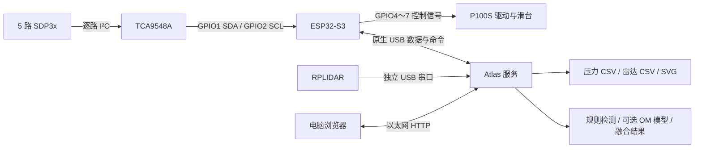

# 无人机具身气压感知实验平台技术报告

供电系统、硬件接口与软件实现  
2026 年 9 月

## 1. 概述

本平台用于研究运动过程中气压变化与障碍物之间的关系。实验通过直线滑台控制感知装置与障碍物的相对位置，在重复运动条件下采集差压和激光雷达数据，分析气流响应，并开展障碍物识别算法验证。

系统由 ESP32-S3、SDP3x 差压传感器、TCA9548A 多路复用器、P100S 滑台、Atlas 200i DK A2 和 RPLIDAR 组成。ESP32 负责压力采集及滑台运动，Atlas 通过两路 USB 分别连接 ESP32 和雷达，承担实验调度、数据保存与识别处理。操作端通过有线网络访问 Atlas 网页。

平台采用 220 V 交流输入，经 AC/DC 电源转换为 24 V，再由 XL4015 模块级联降压，提供 12 V、5 V 和 3.3 V。ESP32 由降压模块供电，风扇采用独立可调电源，工作电压为 18 V，各低压部分共地。

本文说明现有装置的系统结构和程序实现。软件参数以版本 `fb4183a` 及配套编译配置为基准；表中标注为默认值的参数可在配置或控制页面中调整。性能数据采用现有训练记录，电源容量、定位精度和停止距离尚无完整实测结果。

## 2. 平台组成与总体架构

系统按采集控制、上位机处理和机械执行三个部分组织。压力采集与脉冲输出在 ESP32 上完成，使运动控制不依赖浏览器刷新；批次流程与文件管理放在 Atlas 上，便于统一记录实验条件和关联两类传感器数据。

| 部件 | 功能 | 接口或配置 |
|---|---|---|
| ESP32-S3 | 差压采集、滤波、运动控制和遥测 | I²C、GPIO、原生 USB |
| SDP3x 差压传感器 | 测量差压与温度 | 固件配置为 5 路 |
| TCA9548A | 分时接入同地址传感器 | 使用通道 0～4 |
| P100S 驱动及滑台 | 带动感知装置直线运动 | 脉冲＋方向，软件行程 0～2000 mm |
| Atlas 200i DK A2 | 批次控制、数据存储、网页和推理 | 双 USB 接入，有线网络访问 |
| RPLIDAR | 获取扫描点云，提取障碍候选 | USB 串口 |
| 风扇 | 形成实验气流 | 独立 18 V 可调电源 |



正常实验使用 Atlas 联动入口。电脑直连 USB 和 ESP32 Wi-Fi 页面保留用于开发调试。现有软件覆盖实验采集和识别，不包含飞行姿态或飞行动力闭环控制。

## 3. 供电方式

### 3.1 电源结构

主电源将 220 V 交流转换为 24 V 直流。后级采用 XL4015 DC/DC 模块级联降压，形成 12 V、5 V 和 3.3 V 电压。风扇使用独立可调电源，输出设为 18 V。ESP32 从降压模块取电，同时通过原生 USB 与 Atlas 通信。

```text
220 V AC ──→ AC/DC 电源 ──→ 24 V DC
                               │
                               └──→ XL4015 级联降压网络
                                      输出：12 V、5 V、3.3 V

独立可调电源 ──→ 18 V ──→ 风扇

低压系统采用公共地。
```

图示反映电源层级。各级 XL4015 的具体输入、输出及负载接点尚未形成完整接线记录，因此这里不将各电压指定给未经核对的设备。主 AC/DC 电源的额定电流也未记录。

| 项目 | 现有配置 |
|---|---|
| 交流输入 | 220 V |
| 主直流电源 | 24 V |
| DC/DC 型号 | XL4015 |
| 降压方式 | 级联 |
| 降压网络输出 | 12 V、5 V、3.3 V |
| ESP32 供电 | 外接降压模块 |
| 风扇供电 | 独立可调电源，18 V |
| 低压参考地 | 共地 |

### 3.2 级联供电的负载关系

级联结构中，上一级模块承担本级负载及下一级的输入功率。因此，电源容量应从末级向前逐级折算。设某级输出电压为 V，直接负载电流为 I，下一级所需输出功率为 P，转换效率为 η，则本级所需输出功率为：

```text
P_本级输出 = V × I + P_下级输出 / η_下级
```

例如，若 3.3 V 模块由 5 V 供电，5 V 支路除了自身设备，还需承担 3.3 V 支路折算到输入侧的功率。实际模块的温升、线缆压降和负载启动电流也应计入容量评估。目前尚缺少各支路电流及转换效率，故不列出总功耗和供电余量的估算值。

### 3.3 共地与 USB 电源路径

压力采集、滑台信号和 USB 通信共用低压参考地。接线记录应明确公共地汇接点和动力电流的回流路径，尤其应关注滑台运动、风扇启动时采集端的电压波动。

ESP32 同时连接外部降压电源与 Atlas USB。其实际供电关系取决于开发板的电源电路以及 USB 线是否保留 VBUS。后续接线图需标明外部电源接入引脚和 USB 电源路径，避免将数据连接与供电连接混为一体。

## 4. 硬件连接与接口

### 4.1 压力传感器 I²C 总线

| ESP32／主端 | 连接对象 | 参数或作用 |
|---|---|---|
| 3.3 V | TCA9548A VCC | 设计供电电压 |
| GND | TCA9548A GND | 主总线参考地 |
| GPIO1 | TCA9548A SDA | I²C 数据 |
| GPIO2 | TCA9548A SCL | I²C 时钟，配置为 400 kHz |
| TCA SD0 / SC0 | 第 1 路 SDP3x SDA / SCL | 对应软件通道 1 |
| TCA SD1 / SC1 | 第 2 路 SDP3x SDA / SCL | 对应软件通道 2 |
| TCA SD2 / SC2 | 第 3 路 SDP3x SDA / SCL | 对应软件通道 3 |
| TCA SD3 / SC3 | 第 4 路 SDP3x SDA / SCL | 对应软件通道 4 |
| TCA SD4 / SC4 | 第 5 路 SDP3x SDA / SCL | 对应软件通道 5 |

TCA9548A 配置地址为 `0x70`，程序启动时扫描 `0x70～0x77`，找到设备后可以使用实测地址覆盖配置地址。SDP3x 地址配置为 `0x21`。通道选择值为 `1 << ch`，一次选通一路，因此多个相同地址传感器不会在同一读取操作中同时响应。

I²C 驱动启用了 ESP32 内部上拉，主总线电平为 3.3 V。总线运行在 400 kHz，线长和各分支的外部上拉会影响上升沿，应结合实际连线检查波形。现有记录未包含外部上拉阻值。

五路传感器顺序读取，每组数据共用一个主循环时间戳，通道间存在读取时差。分析多通道响应时，还需结合气管长度、正负压口和安装方向解释波形。传感器编号与安装位置的对应表应随实验记录保存。

### 4.2 P100S 控制接口

| ESP32 引脚 | P100S 信号端 | 固件行为 |
|---|---|---|
| GPIO4 | 脉冲 + | RMT 正相脉冲输出，结束电平配置为高 |
| GPIO5 | 脉冲 − | 同步 RMT 通道反相输出 |
| GPIO6 | 方向 + | 按逻辑方向与反向配置异或输出 |
| GPIO7 | 方向 − | 运动任务期间固定为低 |

当前 `CONFIG_DRONE_SERVO_DIR_INVERT=y`。每次运动设置方向后等待约 20 ms，再开始发送脉冲。

滑台信号由 ESP32 GPIO 直接输出，未使用外置信号转换模块。脉冲两路通过 RMT 同步产生互补波形；方向负端在运动期间固定为低，方向接口的行为与脉冲接口不同。直驱连接的电气裕量需结合 P100S 输入规格及端子波形测量确定，尤其是高频下的输入幅值、脉宽与边沿。

代码没有定义专用伺服使能 GPIO、物理急停输入、限位开关输入或编码器反馈输入。现有 `enabled` 字段控制软件是否接受运动，不代表已经切断驱动器使能或主电源。

### 4.3 主机与辅助接口

| 通道 | 用途 | 当前配置 |
|---|---|---|
| ESP32 原生 USB Serial/JTAG | JSON 遥测、文本命令、回复 | 主机常见路径 `/dev/ttyACM0` |
| RPLIDAR USB 串口 | 雷达扫描数据 | 默认 `/dev/ttyUSB0`，115200 baud |
| ESP32 UART1 | 保留的二进制兼容链路 | TX GPIO17，RX GPIO18，115200，8N1 |
| ESP32 UART2 RS485 | 可选 Modbus 路径 | TX GPIO17，RX GPIO18，DE GPIO16；当前未选用 |
| Atlas 有线网络 | 浏览器访问服务 | HTTP 端口 8080，IP 按部署配置 |
| ESP32 Wi-Fi | 本机采集诊断网页 | 固件启动时初始化，SSID 为 DronePressure |

UART1 与可选 RS485 默认复用 GPIO17、GPIO18。若以后启用 Modbus，必须先解决引脚冲突；当前脉冲模式不需要 RS485 外设。

115200 baud 是物理 UART 链路的速率配置。原生 USB 数据经过 USB Serial/JTAG 传输，其吞吐不能按同一 UART 字节率计算。

## 5. ESP32 固件实现

### 5.1 模块职责

| 文件 | 主要职责 |
|---|---|
| `main/main.c` | 初始化、主循环、采样调度、传输调用、看门狗轮询 |
| `main/sdp3x.c` | I²C 建立、TCA 探测、启动命令、CRC 与诊断 |
| `main/sensor_filter.c` | 五路独立滤波状态 |
| `main/servo.c` | RMT 脉冲、运动状态、软限位、心跳锁定、Modbus 辅助接口 |
| `main/motion_profile.h` | 按运动距离计算加减速包络 |
| `main/capture_usb.c` | 原生 USB JSON 输出与文本命令解析 |
| `main/protocol.c` | UART 二进制帧、CRC16、命令确认 |
| `main/wifi_web.c` | ESP32 网页与数据服务 |
| `main/sensor_test.c` | 模拟压力数据 |

### 5.2 初始化与周期任务

主程序依次初始化 UART 协议、USB、运动模块、传感器总线、Wi-Fi 和滤波器，然后启动传感器连续测量。启动失败时记录错误，并在非模拟模式下约每秒重试。

循环先处理 UART 命令、USB 命令和运动看门狗；达到采样时间后读取五路传感器、执行滤波，再依次输出 UART、USB、Wi-Fi 数据。模拟模式改用生成数据，并绕过真实传感器读取及该处滤波。

采样率配置为 200 Hz，对应 5 ms 调度周期；FreeRTOS tick 为 1000 Hz。实际周期受 I²C 读取和数据发送耗时影响。单次 I²C 事务的超时为 20 ms，传感器异常时可超过一个采样周期，因此采样稳定性需通过时间戳间隔和样本序号统计评估。

### 5.3 传感器数据转换与错误处理

程序向每路发送 `0x36 0x15` 启动连续差压测量，采用读取间平均模式。每次读取 9 字节，分别包含压力、温度、比例因子及各自 CRC。

- CRC8 初值 `0xFF`，多项式 `0x31`。
- 压力：`pressure_pa = int16(raw_pressure) / scale_factor`。
- 温度：`temperature_c = int16(raw_temperature) / 200`。
- 比例因子为 0 时判为无效。
- 出错时置 `valid=false`，记录诊断码和累计错误数，并将该次压力、温度置零。

因此，CSV 中的零值需要结合 `valid_mask` 判断。无效读取产生的零不能作为真实的零差压参与训练或统计。诊断覆盖复用器未发现、SDA/SCL 拉低、启动失败、读取失败及三类 CRC 错误。

### 5.4 当前滤波算法

当前启用一维前向卡尔曼滤波，每个通道独立维护估计值和协方差，参数为 `Q=0.03 Pa²`、`R=0.02 Pa²`。

```text
P_prior = P_previous + Q
K = P_prior / (P_prior + R)
x = x_previous + K × (measurement - x_previous)
P = (1 - K) × P_prior
```

首个有效读数直接作为初始估计。无效样本跳过滤波更新，保留之前状态。代码还支持关闭滤波、EMA 和移动平均，但当前配置未启用。

上传字段 `pressure_pa_1..5` 保存经过传感器读取间平均和 ESP32 卡尔曼滤波的压力值。Atlas 绘图可再执行中值和 EMA 滤波。训练输入与在线推理应保持相同处理流程，不能将额外平滑后的绘图数据直接视为在线输入。

## 6. 滑台控制与位置表示

项目采用的脉冲换算参数为 `FA11=10000`、每转移动 125 mm，因此 `10000 / 125 = 80 pulse/mm`。固件初始脉冲参数为 80000 pulse/m，软范围为 0～160000 pulse，即 0～2000 mm。

| 量 | 换算结果 |
|---|---:|
| 单个指令脉冲位移 | 0.0125 mm；这是指令分辨率，不是实测定位精度 |
| 1000 mm/s | 80000 pulse/s |
| 1500 mm/s | 120000 pulse/s |
| 2000 mm/s | 160000 pulse/s |
| 固件脉冲频率上限 | 200000 Hz |
| 位置运动接口速度上限 | 2000 mm/s |

RMT 时基为 10 MHz，通过双通道同步发送互补脉冲。脉冲以小块提交，目标块时间约 10 ms，块大小限制为 8～1024 pulse；发送完成后将块内脉冲累加到软件位置。

因此 `position_mm` 是按已完成发送的脉冲块更新的指令位置估计，并不连续反映真实机械位移。在 80 pulse/mm 下，1024 pulse 对应 12.8 mm。雷达即使进一步对位置插值，也仍基于该估计。

按距离的缓启停使用平方速度关系 `v² = v0² + 2ax`，加速与减速包络共同限制频率；短行程会降低峰值形成三角轮廓。每个发送块内部频率固定，因此实际输出是对连续轮廓的分块近似。

典型实验参数如下。每批实验的实际值随 CSV 一并记录：

| 参数 | 默认值 |
|---|---:|
| 起点／终点 | 10 / 1900 mm |
| 测量速度／复位速度 | 1500 / 1000 mm/s |
| 测量加速／减速距离 | 225 / 75 mm |
| 复位加速／减速距离 | 150 / 150 mm |
| 基线等待 | 2000 ms |
| 终点停留 | 300 ms |
| 实验间等待 | 1000 ms |

固件上电时软件位置从 0 开始，`position_trusted=false`，当前运动模块尚未实现建立绝对位置的归零流程。上电时滑台不在对应物理零点，或出现失步、滑移、发送异常，都会使软件位置与实物位置偏离。软限位依赖这一位置估计。

## 7. 通信协议和控制链路

### 7.1 原生 USB

设备默认持续输出 JSON 行。主要消息为 `hello`、`data`、`status` 和 `reply`。数据包含设备时间 `ms`、样本序号 `seq`、五路压力 `p`、温度 `t`、诊断与错误计数、有效位掩码、软件位置和运动状态。

命令为文本行，主要包括：

| 命令 | 含义 |
|---|---|
| `HELLO` / `STATUS` | 查询协议身份／当前状态 |
| `HEARTBEAT` | 刷新控制链路心跳 |
| `STREAM 0/1` | 控制数据流 |
| `ENABLE 0/1` | 软件运动禁用／启用 |
| `STOP` / `CLEAR` | 进入／解除软件停止锁定 |
| `CONFIG min max pulses_per_mm max_speed` | 配置软限位、脉冲当量和速度上限 |
| `MOVE_MM target speed accel decel` | 绝对位置运动，缓启停单位为 mm |
| `MOVE target speed accel decel` | 旧接口，缓启停单位为 ms |
| `TEST ...` | 配置模拟数据 |

USB 采用非阻塞写入，目前未检查实际写入长度。缓冲区不足时可能出现短写，接收端需通过 JSON 完整性和序号连续性检查数据缺失。该协议未另设应用层 CRC16，因此 UART 的 CRC 错误计数不适合作为 USB 数据完整性的唯一指标。

### 7.2 UART 二进制兼容链路

帧由 8 字节头、负载、2 字节 CRC16 构成；魔数为 `0xA55A`，版本为 2。遥测负载 38 字节，总帧长 48 字节；状态负载 92 字节，总帧长 102 字节，状态约 2 Hz。

按 200 Hz 遥测计算，单向基础流量为 `48×200 + 102×2 = 9804 byte/s`。115200 baud、8N1 的理论字节率为 11520 byte/s，因此基础占用约 85.1%，尚未计入命令确认等额外输出。这解释了为何状态诊断只按低频发送，也表明此链路吞吐余量有限。

### 7.3 看门狗与停止行为

Atlas 约每 200 ms 发送一次心跳；ESP32 超时阈值为 1000 ms。运动已启用或正在运动且心跳过期时，固件设置停止请求、停止锁定及软件禁用状态。

运动任务在脉冲块之间检查停止请求，已经提交的 RMT 块会先完成发送。停止响应时间由命令处理、当前发送块、驱动器响应和机械减速共同决定，尚需实测其最坏值与对应停止距离。

## 8. Atlas 服务、雷达和数据处理

### 8.1 服务组织与批次状态机

`service.py` 使用独立串口线程、雷达线程、批次线程和 HTTP 服务。串口自动识别 ESP32 JSON 或兼容二进制协议；运动命令等待确认，批次流程根据新的遥测判断到位。

```text
配置与软件启用 → 回起点 → 等待基线 → 正向运动并记录
→ 终点停留 → 停止本次记录 → 反向复位 → 实验间等待
→ 下一次实验 → 结束、关闭文件并生成图像
```

批次状态机运行在 Atlas 服务端，关闭或刷新浏览器后仍继续执行。批次的基线等待和回程不属于当前压力主记录区间；正向记录包含终点停留，应结合实际数据识别运动阶段，避免把停留造成的特征误认作障碍效应。

### 8.2 雷达处理

`lidar_runtime.py` 负责连续扫描，`lidar_workflow.py` 提供节点解析、坐标变换和独立采样流程。默认安装俯角为 45°，使用标准 5 字节扫描节点；具体型号应与该扫描模式匹配。

| 参数 | 服务默认值 |
|---|---:|
| 雷达启用 | False |
| 有效距离范围 | 50～6000 mm |
| 每圈最少点数／角度覆盖 | 80 点／270° |
| 轨道范围 | 0～2000 mm |
| 走廊半宽 | 350 mm |
| 高度范围 | −100～1800 mm |
| 聚类分箱／最少点数 | 50 mm／3 点 |
| 持续圈数 | 3 圈 |

位置时间线使用主机单调时钟与 ESP32 位置，区间内线性插值，区间外采用端点值。该方式比简单用设定速度乘时间更贴合加减速过程，但不构成硬件同步，也不能消除 USB 延迟、分块位置更新与机械误差。

雷达空间映射需要确认安装点是否随滑台移动、坐标原点、俯角、扫描朝向及传感器之间的偏移。当前姿态由固定俯角参数给定，未使用实时 IMU 数据。

### 8.3 压力与雷达融合

服务将压力异常和雷达候选按时间、位置匹配，默认容差 1500 ms 和 450 mm，事件保持 1200 ms。输出包含 `confirmed`、`lidar_suspected`、`pressure_suspected`、`clear` 或 `unknown`。

这些容差属于可调默认值。以 1500 mm/s 计算，450 mm 对应 0.3 s 的匀速位移；应通过同步实验判断是否过宽或过窄。融合结果用于展示与记录，当前不会直接触发障碍驱动的滑台停止。

### 8.4 文件结构与数据意义

批次输出保存在 `atlas/data/<实验条件>/`，压力 CSV 为 schema 6；雷达启用时另有 `*_lidar.csv`。两者保留批次、实验编号及主机单调时钟，便于关联。

压力文件记录压力、温度、有效掩码、指令位置、运动状态、实验速度与缓启停参数、雷达候选和融合结果。雷达文件记录逐点角度、距离、质量、轨道估计位置及世界坐标。SVG 用于批次叠加和同条件对比；绘图默认额外使用中值窗口 5、EMA 权重 0.35。

数据分析应同时保存现场风扇状态、障碍距离、传感器安装、供电和气路条件；仅有实验标签不足以解释气压波形变化。

## 9. 模型训练与验证结果

当前训练方案采用单通道 `pressure_pa_1`，先按实验或批次组织数据，再生成因果窗口，经过 CNN 训练后导出 ONNX，计划转换为 OM 供 Atlas 推理。网络输入包含软件预处理，外部应提供与训练一致的压力序列。

现有训练产物的参数和验证结果如下，数据来源为 `training/training/output/manifest.json`：

| 项目 | 结果 |
|---|---:|
| 输入形状 | `[1,1,1,200]` |
| 采样率／窗口 | 200 Hz／1000 ms |
| 压力通道 | 第 1 路 |
| 概率阈值 | 0.55 |
| 验证精确率 | 54.49% |
| 验证召回率 | 82.20% |
| 验证平衡准确率 | 67.96% |
| 验证 F1 | 65.54% |
| 独立测试集 | 未提供，`test_runs=[]`、`test_metrics=null` |

这些指标来自窗口级验证集，其中验证数据还用于选择分类阈值。由于没有独立测试集，结果主要反映当前训练阶段的分类表现，尚不足以评价完整实验中的误报率和跨条件泛化能力。

服务提供可选 OM 推理后端，默认关闭；默认窗口为 200，阈值为 0.5。上述训练产物采用 0.55 阈值，部署时应同步更新配置。旧部署示例中的 100 点窗口也应改为与模型一致的 200 点。板端 OM 加载状态需以运行日志为准。

`HybridDetector` 使用 `ais_bench` 创建推理会话，模型缺失或失败时回退规则检测并报告 `model_error`。模型无效输入分支不会追加窗口，也未在该分支清空旧窗口；数据中断后窗口可能跨越间断，应在正式评估前核验连续性要求。

## 10. 现阶段的主要问题

### 10.1 电源容量与接口裕量

XL4015 采用级联连接，上级负载随下级功耗增加。目前各级电流、主电源额定电流和满载温升尚未形成测量记录，供电余量仍需核算。应在风扇运行、滑台加速和 Atlas 推理同时进行的工况下，测量各电压节点的波动及模块温升。

滑台采用 GPIO 直驱。高频脉冲下的接口裕量需要通过端子波形核验，单凭软件输出频率不能判断驱动器是否完整接收脉冲。测量应覆盖幅值、脉宽、边沿和两路同步关系。

### 10.2 位置基准与停止响应

软件位置依据脉冲计数，缺少归零和反馈校正。其误差既包括上电位置基准，也包括可能发生的机械滑移或驱动脉冲漏计。后续应先建立可重复的物理零点，再对短行程和全行程进行位移对照。

现有停止逻辑通过停止脉冲输出和锁定软件状态实现。物理使能、限位及急停回路需单独记录和验证；软件状态 `enabled=false` 不能用于说明驱动器已断电。停止时间与停止距离应分别在低速、常用速度和最大设置速度下测量。

### 10.3 数据连续性

200 Hz 采样周期较短，I²C 超时会直接影响主循环节拍，USB 非阻塞发送也存在短写可能。建议增加周期统计和发送完整性计数，并在文件检查中同时使用样本序号、设备时间和有效位掩码。

保留的 115200 baud UART 链路基础带宽占用约 85%，附加诊断和命令确认会进一步占用余量。当前主要使用原生 USB，但 UART 输出仍由主循环调用，需关注其阻塞对采样的影响。

### 10.4 识别结果的适用范围

压力模型目前只有验证集结果，精确率约 54.49%，说明该阈值下仍存在较多误报。后续评估应以完整实验为单位，统计误报次数、障碍召回率和提前报警时间，并使用跨日期、跨条件的独立测试批次。

压力与雷达的融合还受安装偏移、软件位置误差和通信时延影响。现有 1500 ms、450 mm 容差需要用同步数据标定。模型窗口在无效数据期间保留旧样本，恢复后可能跨越时间间断，正式评估前应明确间断处理规则。

## 11. 后续验证安排

首先完善电源与接口记录，包括各级 XL4015 的输入输出、设备接点、USB 电源路径、传感器型号及气路编号。随后开展带载供电测量和低速运动核对，建立位移基准，再逐步验证常用速度下的采样连续性、停止响应和雷达坐标。

算法测试应在硬件状态固定后进行。有障碍和无障碍实验分别采集，保持同批次内风扇电压、安装位置和运动参数一致；另留独立批次检验模型泛化。实验记录至少包含供电状态、风扇工作条件、障碍距离、运动参数和异常情况，以便区分气流特征、机械振动及电源扰动。

验收记录应保留实际采样频率、有效样本比例、位移误差、停止距离，以及完整实验的误报和漏报统计。现有软件配置与训练验证结果不能替代这些实测指标。

## 附录：软件文件索引

- `README.md`：项目架构、接线和典型实验参数。
- `sdkconfig`、`sdkconfig.defaults`、`main/Kconfig.projbuild`：目标硬件与当前编译配置。
- `main/main.c`、`main/sdp3x.c`、`main/sensor_filter.c`：采样、诊断与滤波。
- `main/servo.c`、`main/motion_profile.h`：位置、运动、停止和脉冲实现。
- `main/capture_usb.c`、`main/protocol.c`：两种通信链路。
- `atlas/service.py`、`atlas/lidar_runtime.py`、`atlas/model_detector.py`：采集、融合与推理实现。
- `atlas/README.md`、`training/README.md`：部署与训练工作流。
- `training/training/output/manifest.json`：现有训练产物参数与验证指标。
